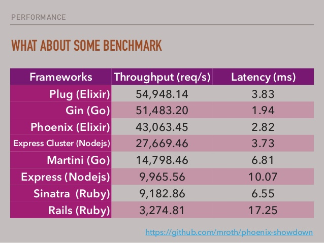

#HSLIDE
## Функционално програмиране с Elixir

#HSLIDE


#HSLIDE
### Кои сме ние?

* Ние ползваме Elixir в свободното си време. <!-- .element: class="fragment" -->
* Ние ползваме професионално Elixir. <!-- .element: class="fragment" -->
* Това е втората година на курса. <!-- .element: class="fragment" -->
* Създаваме материали и код свързани с курса.   <!-- .element: class="fragment" -->

#HSLIDE


#HSLIDE
### Кои сте вие?

* Искате да разберете защо напоследък се говори за Erlang/Elixir?             <!-- .element: class="fragment" -->
* Фенове сте на Elixir/Erlang и искате да учите Elixir?                       <!-- .element: class="fragment" -->
* Искате да изкарате курс от типа 'Програмиране с |език|', за да си обогатите познанията? <!-- .element: class="fragment" -->
* Искате да запишете курс от типа 'Програмиране с |език|' за лесни кредити? <!-- .element: class="fragment" -->

#HSLIDE
### Защо да учим нов език?!

* Нали си знам PHP | JAVA | C# | Ruby | Python | Това-с-което-(ще-)си-вадя-хляба? <!-- .element: class="fragment" -->
* Тези хипстъри, дето всяка година учат нов език, за нищо не стават!  <!-- .element: class="fragment" -->
* Всяка година, не, всяка седмица нова 'технология', то не може всичко я! <!-- .element: class="fragment" -->

#HSLIDE


#HSLIDE
### Защо да учим Elixir?

* Всички твърдения от предния слайд са вярни. Не всичко работи за всички. <!-- .element: class="fragment" -->
* Няма сребърен куршум, но за всичко си има набор от добри инструменти. <!-- .element: class="fragment" -->
* Дайте шанс на този набор от инструменти? <!-- .element: class="fragment" -->

#HSLIDE
### Какво е Elixir?

* Elixir е език, който върви на BEAM. <!-- .element: class="fragment" -->
* BEAM e виртуалната машина на Erlang.  <!-- .element: class="fragment" -->
* Ахаа! Значи нещо като Scala, както се отнася към Java?  <!-- .element: class="fragment" -->
* И да, и не.  <!-- .element: class="fragment" -->
* Elixir е Erlang. Но и нещо повече. <!-- .element: class="fragment" -->

#HSLIDE
### Какво е Erlang?


#HSLIDE
Erlang е създаден с цел: писане на телеком програми

* Конкурентни (едно устройство трябва да може да поддържа хиляди едновременни транзакции). <!-- .element: class="fragment" -->
* Толерантни към грешки и проблеми - както софтуерни, така и хардуерни.  <!-- .element: class="fragment" -->
* Практически нулев downtime.  <!-- .element: class="fragment" -->
* Кодът им трябва да може да се заменя с по-нови версии, докато те работят.  <!-- .element: class="fragment" -->

#HSLIDE
#### А какви проблеми имаме днес?
 <!-- .element: class="fragment" -->

#HSLIDE


#HSLIDE


#HSLIDE


#HSLIDE
Joe Armstrong (създател на Erlang) нарича Erlang език за конкурентно-ориентирано програмиране, като се базира на няколко правила:

#HSLIDE
### Erlang!
1. Кодът върви в процеси, които са на ниво език.
2. Тези процеси не споделят памет - имат собствен стек и собствен heap. <!-- .element: class="fragment" -->
3. Много са евтини за създаване и си комуникират чрез размяна на съобщения.  <!-- .element: class="fragment" -->
4. Лесно могат да си комуникират помежду си, дори да са на различни машини. <!-- .element: class="fragment" -->
5. Ако един процес 'умре', другите продължават да живеят. Може нов да го замести, зависи от стратегията. <!-- .element: class="fragment" -->

#HSLIDE
### Erlang върви на BEAM

* BEAM е способна да използва всички ядра на процесора без проблем. <!-- .element: class="fragment" -->
* BEAM-level процесите са много малки 1KB-2KB при създаването си. <!-- .element: class="fragment" -->
* Можем да създаваме огромен брой процеси без да се притесняваме. Говорим за милиони.  <!-- .element: class="fragment" -->
* Scheduler-ите на BEAM използват стратегия, различна от стратегиите в други езици - превантивна стратегия.  <!-- .element: class="fragment" -->

#HSLIDE
### Let it CRASH!!!


#HSLIDE
### Кой ползва Erlang?

#HSLIDE
* Amazon - за базата данни SimpleDB
* Yahoo! - за URL bookmarking  <!-- .element: class="fragment" -->
* WhatsApp - написана на Erlang, real-time съобщения, купена от Facebook  <!-- .element: class="fragment" -->

#HSLIDE
* T-Mobile, Motorola, Ericsson - за SMS услуги и 3G/4G мрежи. Ericsson са създатели на Erlang.
* RabbitMQ - AMQP имплементация  <!-- .element: class="fragment" -->
* CouchDB - популярна база данни  <!-- .element: class="fragment" -->
* Riak - data store  <!-- .element: class="fragment" -->

#HSLIDE
### Та какво е Elixir??

* Elixir наследява всички специфики и идеологии на Erlang. Все пак върви на BEAM. <!-- .element: class="fragment" -->
* Elixir може да използва всичко писано на Erlang. <!-- .element: class="fragment" -->
* Elixir идва с много добър инструментариум. <!-- .element: class="fragment" -->
* Elixir има много добро и бързо-растящо общество. <!-- .element: class="fragment" -->
* Elixir е модерен език, добър за web и IoT. <!-- .element: class="fragment" -->
* Споменахме ли, че е функционален език? <!-- .element: class="fragment" -->

#HSLIDE


#HSLIDE
### Началото

* Езикът се ползва някъде от 2013 (2011 първи копки) година, което го прави доста млад. <!-- .element: class="fragment" -->
* Създателят на Elixir, Жозе Валим (José Valim), идва от ruby/rails света. <!-- .element: class="fragment" -->
* Бързо набира популярност сред рубистите и ерлангаджиите. <!-- .element: class="fragment" -->

#HSLIDE


#HSLIDE
### Защо да учим Elixir?
* Защото можем да си напишем сървис, който ще поддържа хиляди потребителя online и ще живее в един OS процес.
* Защото имаме качествен инструментариум! <!-- .element: class="fragment" -->

#HSLIDE
### Инструментариум

* Elixir идва с mix. <!-- .element: class="fragment" -->
* Mix изпънява различни задачи - да речем прави нов Elixir проект. <!-- .element: class="fragment" -->
* Много лесно е да си напишем и своя задачка. <!-- .element: class="fragment" -->

#HSLIDE
### MIX


#HSLIDE
### Инструментариум

* Всъщност с mix можем да си направим собствена библиотека. <!-- .element: class="fragment" -->
* И да я качим в hex, откъдето можем да сваляме библиотеки на други хора. <!-- .element: class="fragment" -->
* Също така mix се справя страхотно с dependencies. <!-- .element: class="fragment" -->
* Има вградена добра библиотека за тестване. <!-- .element: class="fragment" -->
* Има лесен начин за генериране на HTML документация с връзки към кода. <!-- .element: class="fragment" -->

#HSLIDE
### NOT MIX


#HSLIDE
### Защо да учим Elixir?
* Защото можем да си напишем сървис, който ще поддържа хиляди потребителя online и ще живее в един OS процес.
* Защото имаме качествен инструментариум!
* Защото езикът е доста приятен и лесен за продуктивна работа!! <!-- .element: class="fragment" -->

#HSLIDE
### Продуктивност


#HSLIDE
### Езикът Elixir в няколко изречения:

* Модули, които са колекции от функции.
* Всичко е immutable.
* Кодът е изграден от композирани функции.
* Всичко върви в BEAM-процес.
* Кодът в тези BEAM-процеси е последователен, процесите вървят конкурентно един на друг.


#HSLIDE
#### Модули, колекции от функции:

```elixir
defmodule MyModule do
  import OtherModule

  def public_function(x) do
    x * private_function(x)
  end

  defp private_function(x) do
    x + other_module_public_function(x)
  end
end
```

#HSLIDE
#### Кодът е изграден от композирани функции:

```elixir
[1, 2, 3, 4, 5]
  |> Enum.map(fn n -> n * n end)
  |> Enum.filter(fn n -> n > 10 end)
  |> Enum.reduce(1, &(&1 + &2))

# -> 42
```

#HSLIDE
#### Кодът е изграден от композирани функции:

```elixir
File.stream!("path/to/some/file")
|> Stream.flat_map(&String.split(&1, " "))
|> Enum.reduce(%{}, fn word, acc ->
  Map.update(acc, word, 1, & &1 + 1)
end)
|> Enum.to_list()
```

#HSLIDE
#### Pipes


#HSLIDE
#### Функционален език:
```elixir
4 = 4                 # Интерпретира се без грешка
5 = 4                 # Грешка - MatchError
a = 4                 # Няма грешка, 'a' има стойност 4
{d, e, 5} = {7, 6, 5} # d става 7, e става 6

f = fn (x) -> x * x end
f.(3)
# -> 9
```

#HSLIDE
#### Функционален език:
```elixir
f = fn
  (5) -> {:ok, 5}
  (x) -> {:error, x}
end
{:ok, x} = f.(5)     # Успех, x получава стойност 5
{:ok, x} = f.(6)     # Грешка, резултатът е {:error, 6}

Map.put(%{a: 3}, :b, 4)
# %{a: 3, b: 4} -> Нов map
```

#HSLIDE
#### Процеси:
Процесите в Elixir/Erlang се създават със `spawn`.

```elixir
# Тази функция ще се изпълни в нов процес:
pid = spawn fn -> 2 * 21 end

Process.alive?(pid)
# false, тъй като функцията се изпълнява бързо.

# Можем да ползваме pid-а на текущия процес с:
self()
Process.alive?(self()) # true
```

#HSLIDE
#### Процеси:

```elixir
pid = spawn(fn ->
  receive do
    {:howdy, message} -> IO.puts(message)
    {_, message} -> IO.puts("Няма значение")
  end
end)

send pid, {:howdy, "Как си?"}
```

#HSLIDE
Parallel map(collection):

```elixir
defmodule PEnum do
  def pmap(collection, mapper) do
    collection
    |> Enum.map(&(Task.async(fn -> mapper.(&1) end)))
    |> Enum.map(&Task.await/1)
  end
end
```

#HSLIDE
No shared state, threads and locks.


#HSLIDE
### Защо Elixir?
* Защото можем да си напишем сървис, който ще поддържа хиляди потребителя online и ще живее в един OS процес.
* Защото имаме качествен инструментариум!
* Защото езикът е доста приятен и лесен за продуктивна работа!!
* Защото с Elixir сме МЕТА! <!-- .element: class="fragment" -->

#HSLIDE
### Metaprogramming


#HSLIDE
### Metaprogramming

* Всъщност defmodule е макро.
* Както и def за функция.
* Както и почти всичко, което ще ползвате.

#HSLIDE
### Metaprogramming


#HSLIDE
### Elixir е написан на Elixir


#HSLIDE
### Защо Elixir?
* Защото можем да си напишем сървис, който ще поддържа хиляди потребителя online и ще живее в един OS процес.
* Защото имаме качествен инструментариум!
* Защото езикът е доста приятен и лесен за продуктивна работа!!
* Защото с Elixir сме МЕТА!
* Защото обществото около Elixir ще ви приветства! <!-- .element: class="fragment" -->

#HSLIDE
#### Обществото
* Elixir обществото раздвижи Erlang обществото.
* Erlang се развива, Elixir програмисти правят PR-и, помагат.
* Имаме и ще имаме множество чудесни библиотеки.


#HSLIDE
### В Elixir/Erlang има бъдеще


#HSLIDE
### Защо да учим Elixir?
* Защото можем да си напишем сървис, който ще поддържа хиляди потребителя online и ще живее в един OS процес.
* Защото имаме качествен инструментариум!
* Защото езикът е доста приятен и лесен за продуктивна работа!!
* Защото с Elixir сме МЕТА!
* Защото обществото около Elixir ще ви приветства!
* И всички тези mixture-и! <!-- .element: class="fragment" -->

#HSLIDE
#### Plug & Phoenix



#HSLIDE
#### Ecto


#HSLIDE
#### И още и още


#HSLIDE
#### Ще си говорим и за доста advanced неща!


#HSLIDE
### Кой ползва Elixir?

#HSLIDE
* Adobe - За колаборативна работа над фотографски материали.
* Discord - За voice/text чат за геймъри.
* Pinterest - Социална мрежа, написана на Elixir. За споделяне и тагване на хоби идеи по снимки.

#HSLIDE
* Pivotal - RabbitMQ CLI е написан на Elixir.
* Slack - Сървърите, поддържащи видео разговорите, са на Elixir.
* http://elixir-companies.com - Списък с компании, ползващи Elixir.

#HSLIDE
### Защо да научим Elixir?
* Защото е модерен, конкурентен език.
* Защото хората зад и около него са опитни.
* Защото основата му, Erlang, е стабилна и доказана.
* Защото е функционален език.
* Защото е подходящ за писане и поддръжка на много типове приложения.
* Защото ще разшири кръгозора ви.
* Защо не?

#HSLIDE
## Контакти

* https://elixir-lang.bg
* https://www.facebook.com/groups/636900123169076/
* course@elixir-lang.bg

#HSLIDE
## Край

